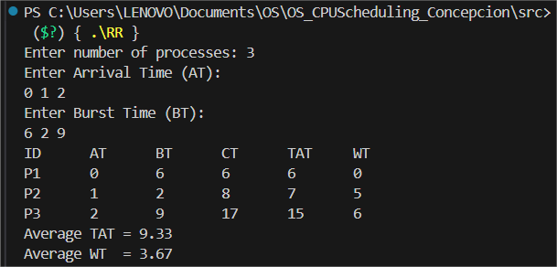
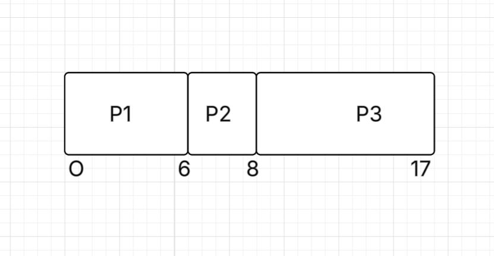
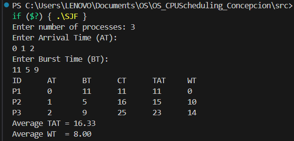
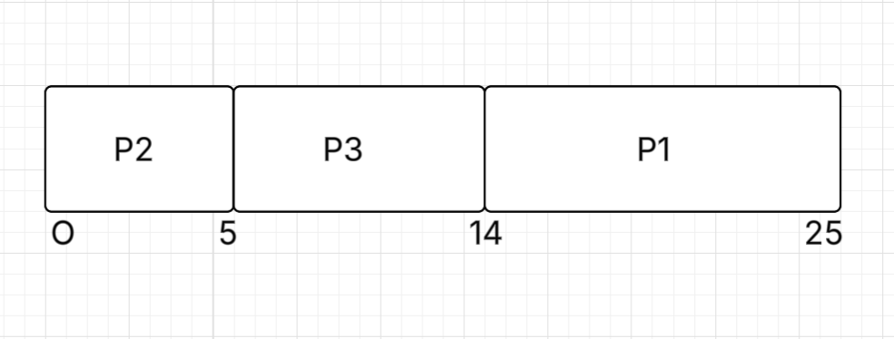
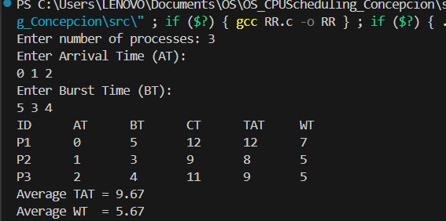
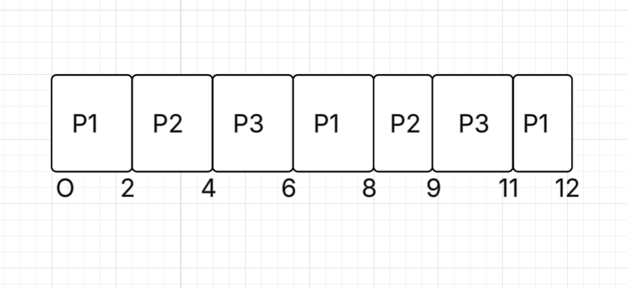

*CPU SCHEDULING*

1. FCFS (First-Come, First-Served)
   
- The FCFS algorithm schedules processes in the order they arrive in the ready queue.
  The process that arrives first is executed first, and others wait in the queue.
- It is non-preemptive as once a process starts, it runs to completion before the next begins.

  Sampple Output:

  

  Gantt Chart:

  

 2. SJF (Shortest Job First)
     
- SJF schedules the process with the shortest burst time next.
It can be implemented as either preemptive (Shortest Remaining Time First, SRTF) or non-preemptive.

Sampple Output:

  

  Gantt Chart:

  

  3. RR (Round Robin)

- RR assigns a fixed time quantum to each process in the ready queue.
  Each process gets a turn for the specified time slice; if it doesn’t finish, it goes to the back of the queue.

   Sampple Output:

  

  Gantt Chart:

  

  
