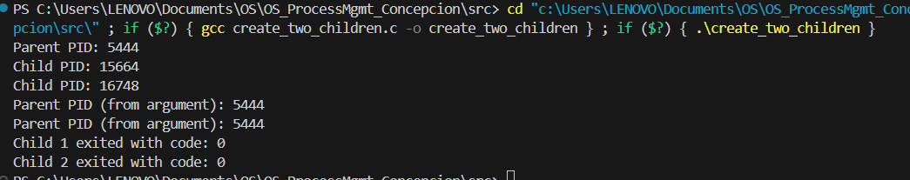
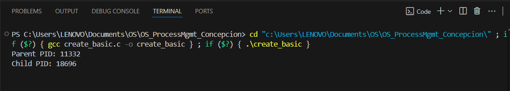
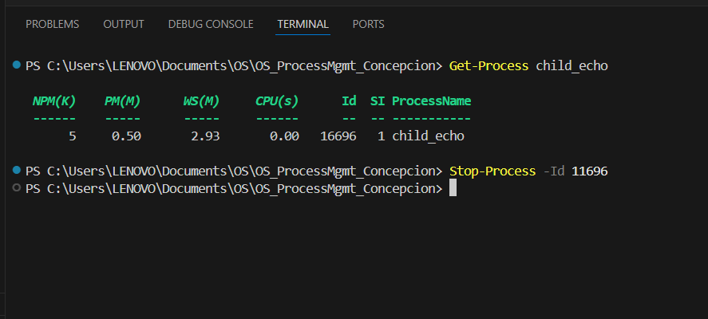

Build instructions for VS Code (MinGW)

1. Build Instructions for VS Code (MinGW)
-Setup MinGW:
-Download MinGW and install.
-Add MinGW’s bin folder to your system PATH (e.g., C:\MinGW\bin).

Building in VS Code:
-Open your project folder in VS Code.
-Open Terminal:
-View > Terminal (or <kbd>Ctrl</kbd> + <kbd>`</kbd>).
-Compile your program:

Sample Outputs: 
Running the Program:

Viewing the Program:

*NOTES ON EACH TASK*

-If the command finishes with no errors, compilation succeeded.
I-f you see errors, check for typos or missing libraries.

Run Tasks:

If your program expects arguments, running without them may show a usage message.
If the program exits instantly, you may not catch it with Get-Process.

Process Management:

-Get-Process child_echo shows the running process only while it’s alive.

-Stop-Process -Id <PID> stops the process immediately.

-Normal Termination: Your program finishes and runs all cleanup code.

-Forced Termination: The process is killed; any cleanup after the current instruction will not run.

  
